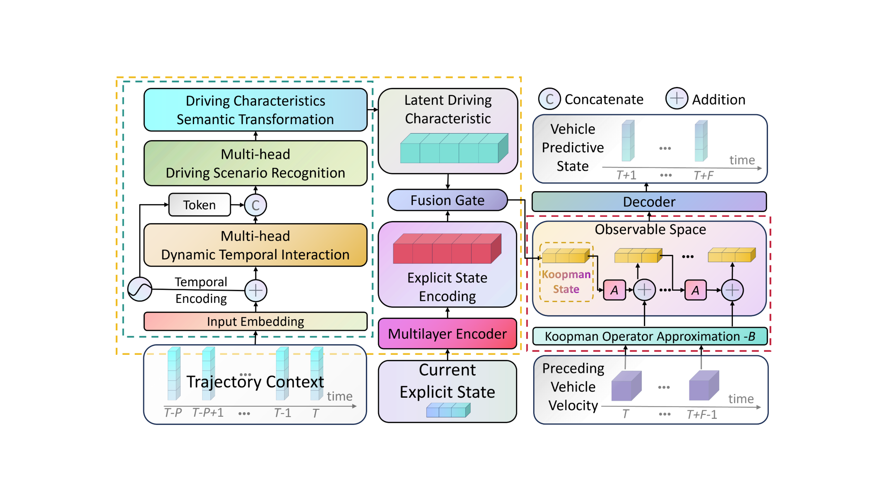

#  AdapKoopPC: Mitigating Traffic Oscillations in Mixed Traffic Flow with Scalable Deep Koopman Predictive Control

This repository contains partial code implementation for the paper "Mitigating Traffic Oscillations in Mixed Traffic Flow with Scalable Deep Koopman Predictive Control". The complete code with full annotations and pre-trained weight files will be released within two weeks after the paper is accepted.

## Overview
AdapKoopPC is a method based on deep Koopman predictive control for mitigating traffic oscillations in mixed traffic flow. This approach learns the Koopman representation of vehicle dynamics to effectively control mixed traffic flow.

## Main Contributions

- The deep Koopman network-based trajectory prediction model (AdaptKoopnet) is developed to simulate and predict the complex car-following behavior of HDVs under different driving scenarios. AdaptKoopnet directly learns and extracts potential scenarios and driving characteristics from naturalistic driving trajectory data, without relying on pre-labels; 
- The AdapKoopnet-based predicted control framework, AdapKoopPC, is proposed for real-time control of CAVs in mixed traffic flow. AdapKoopPC can adaptively adopt multiple AdapKoopNets to form a mixed traffic system based on the vehicle composition of the local mixed flow, and then implement the control strategy;
- The experiments are designed and conducted to validate the effectiveness and superiority performance of AdapKoopnet and AdapKoopPC framework proposed in this paper, covering small-scale traffic systems (10 vehicles) and large-scale traffic systems (50 vehicles) with lower CAVs penetration rates. The results demonstrate the ability of AdapKoopPC to reduce traffic flow oscillations and improve traffic flow stability.

## Abstract

The use of connected automated vehicle (CAV) is advocated to mitigate traffic oscillations in mixed traffic flow consisting of CAVs and human driven vehicles (HDVs). This study proposes an adaptive deep Koopman predictive control framework (AdapKoopPC) for regulating mixed traffic flow. Firstly, a Koopman theory-based adaptive trajectory prediction deep network (AdapKoopnet) is designed for modeling HDVs car-following behavior. AdapKoopnet enables the representation of HDVs behavior by a linear model in a high-dimensional space. Secondly, the model predictive control is employed to smooth the mixed traffic flow, where the combination of the linear dynamic model of CAVs and linear prediction blocks from AdapKoopnet is embedded as the predictive model into the AdapKoopPC. Finally, the predictive performance of the prosed AdapKoopnet is verified using the HighD naturalistic driving dataset. Furthermore, the control performance of AdapKoopPC is validated by the numerical simulations. Results demonstrate that the AdapKoopnet provides more accuracy HDVs predicted trajectories than the baseline nonlinear models. Moreover, the proposed AdapKoopPC exhibits more effective control performance with less computation cost compared with baselines in mitigating traffic oscillations, especially at the low CAVs penetration rates. The code of proposed AdapKoopPC is open source.

## Framework

**"The model architecture of AdapKoopnet"**


## Simulation Results

Below are some simulation results from our experiments:

**Velocity Profiles**

*Figure 1: The mixed traffic flow velocity evolution comparison under different control methods*

**Space-Time Diagram**

*Figure 2: The mixed traffic flow evolution with AdapKoopPC under different CAVs penetration rates*

## Environment and Installation

This code is developed based on Python 3.9+ with the following main dependencies:
- numpy
- torch (PyTorch)
- matplotlib
- scipy
- pandas
- **Operating System**: Windows/Ubuntu 20.04
- **CUDA Version**: 11.x/12.1 (for GPU acceleration)

### Installation

1. Clone the repository:
```bash
git clone https://github.com/SpaceTrafficSafetyTeam/AdapKoopPC.git
cd AdapKoopPC
```

## Code Structure

This repository includes the following main files:

- `control.py`: Main program entry, containing simulation and control algorithm implementation
- `config.py`: Configuration file with all simulation parameter settings
- `KMPC/`: Koopman Model Predictive Control related modules
  - `km.py`: Koopman matrix construction
  - `ko.py`: Koopman optimizer
  - `rs.py`: Vehicle state reconstruction
- `adapkoopnet.py`: Adaptive Koopman network model implementation

## Usage Instructions

Run the `control.py` file directly to start the simulation:

```bash
python control.py
```

Simulation parameters can be adjusted in `config.py`, including the number of vehicles, CAV penetration rate, control parameters, etc.

## Complete Code Release Plan

The complete code (including detailed annotations and pre-trained weight files) will be released within two weeks after the paper is formally accepted. The complete version will include:

- Detailed code annotations
- Pre-trained model weights
- More examples and usage instructions
- Data processing scripts

## Citation

If you use this code in your research, please cite our paper:

```
@article{lyu2025mitigating,
  title={Mitigating Traffic Oscillations in Mixed Traffic Flow with Scalable Deep Koopman Predictive Control},
  author={Lyu, Hao and Guo, Yanyong and Liu, Pan and Zheng, Nan and Wang, Ting and Yue, Quansheng},
  journal={arXiv preprint arXiv:2502.00043},
  year={2025}
}
```
## Contact
Please contact lyu_hao@seu.edu.cn or guoyanyong@seu.edu.cn, if you have any questions.
